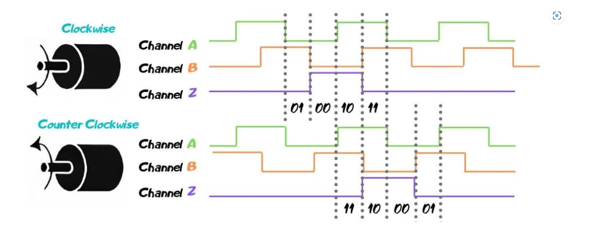

# drive_esp_galileo_2024 Documentation
## Control Flow Summary

This code is for a robot control system using ROS (Robot Operating System) to interface with an Arduino. The system controls motors and reads encoder values to monitor motor positions. Here's a summarized version of the control flow:

### Initialization
1. **Include Libraries:**
   - `ros.h`, `std_msgs/Float32MultiArray.h`, `std_msgs/Int32MultiArray.h`.

2. **Define Constants and Variables:**
   - Pins for PWM and direction control (`PWMpin` and `dirpin` arrays).
   - Default motor directions (`defaultdir` array).
   - Node handle for ROS (`nh`).
   - Buffers for motor commands (`drive_buf` array) and encoder feedback (`enc_feed` array).

3. **ROS Message and Subscriber/Publisher Setup:**
   - Define ROS messages and topics for motor commands and encoder feedback.
   - Subscribe to motor command topic and publish encoder feedback.

### Setup Function
1. **Pin Initialization:**
   - Set encoder pins (`encA` and `encB` arrays) as inputs with pull-up resistors.
   - Set PWM and direction pins as outputs.

2. **Attach Interrupts:**
   - Attach interrupts to encoder pins to call corresponding callback functions.

3. **Initialize ROS Node:**
   - Set baud rate and initialize the ROS node.
   - Advertise the encoder feedback topic and subscribe to the motor command topic.

### Loop Function
1. **Spin ROS Node:**
   - Call `nh.spinOnce()` to handle ROS communication.

2. **Motor Control:**
   - Iterate through `drive_buf` to control motor PWM and direction based on received commands.

3. **Update Encoder Feedback:**
   - Calculate encoder positions in degrees and store in `enc_feed` array.
   - Publish encoder feedback to the ROS topic.

4. **Delay:**
   - Add a short delay to control the update rate.

### Callback Functions
- **Motor Command Callback:**
  - Update `drive_buf` with received motor commands.

- **Encoder Interrupt Callbacks:**
  - Update encoder positions based on the state of encoder pins.

## Functions
### Callback Functions 
* messageCb
  This function is called whenever it recieves a message from the topic ` motor_pwm ` . This functions is used to send the ` PWM ` signals to the motors ` (4 drivers and 4 steering) `. It gets the input from the reference variable ` drive_inp ` and stores the ` PWM ` values in the temporary variable ` drive_buf ` ` (inside the for loop) `
### Interrupt Functions

  * These type of functions are subclass of callback functions. These functions are called when the value of assigned variable changes. For example, In this code ` attachInterrupt(digitalPinToInterrupt(encA[0]),callback_0,RISING); ` whenever the encA[0] risess from 0 to 1, the attached interrupt function ` callback_0 ` is called.
    
      1. The digitalPinToInterrupt() function  returns the pin number if it can be used as an interrupt.
      2. The ` attachInterrupt ` can take 3 inputs : pin to be setted ` Interrupt Service Routine ` : These functions won't take any input and does not return anything, but runs whenever there is change in value . ` Mode ` : RISING,FALLING or CHANGE , this tells when the ISR functions to be called.
      3. In total there are '7 callback functions for each encoder, Named from ` callback_0 ` to ` callback_6 `
 
   * In each ` callback_x ` Functions it checks whether ` encA[x] ' and ` encb[x] ` are equal or not . If it is equal then the `enc_pos` is incremented by one, Otherwise it is decremented one.
   * The reason we are doing so because, we had used quadrature encoders ( these type of encoders have high accuracy and reliability ) . These give data in two channels and there is a constant 90 degree difference between both the channels.
     * If channel A leads then indicated that the motor is oving in anti_clockwise direection and vice-versa.
     * Our, seniors used a clever idea to find the direction of motion of encoders. They only considered at the time of ` Rising edge ` of one channel (here it is channel A) . At that time if we compare both the channels, then there can be two possibilities .
       *  If both the values are same then it is moving in ` anti_clockwise ` and we are incrementing the enc_pos .
       *  If both the values are not equal then it is moving in ` clockwise ` and we are derementing the enc_pos

)

### Setup
* First we are setting the pinmode for the channels for data input from the encoders.
    * They are defind as input_pullup that is switches. These switches are used to timely get the information from the encoders.
* Then we are setting the pinmode of the motor drivers input of PWM and direction.
    * They are defined as output as the drivers are taking the output from the esp and passing these values to the motors. 
* Then we call the Interrupt function on the A channel of all the encoders. This is the main part where we extract the information from the encoders regarding the position and the direction.
* Then we set the encoder message, its layout and its dimension.

### Loop
* For each encoder, we give the direction and PWM values to the motor drivers connected to the respective pins.
* We have set a condition where if the input from the rostopic is positive then we give the default positive direction to the motors. And if the supplied velocity is negative then we give negative of the default defined direction.
* We have set a maximum speed limit of 80 that is until the supplied velocity is 80, we publish that velocity and if it exceeds the value then we give 80 as the velocity.
* We are also modifying the values of the enc_pos for unit change mostly and publishing them to the base station via enc_feed.

## Intuition on Variables

#### 1. PWMpin[8]:
* It is an array containing all the ` pins ` in an array where the` 8 motor drivers `are attached. 
* It has `initial 4 pins` for the drive motor drivers in the order of ` Left front, right front, left rear, right rear `. 
* The other 4 are for steering.

####  2. dirpin[8]:
* It is an array having all the `pins` where the motor drivers' direction pins are attached 
* It follows the same format as the PWMpin for the order inside the array.

#### 3. defaultdir[8]:
* It is an array containing the `direction values` to be fed to the `drivers`.
* By default, it has all `1s` in the drive values.
* 1 specifies forward direction velocity and 0 spicifies backward direction velocity.

#### 4. drive_buf[8]:
* It contains all the `pwm` values that we recieve from subscribing to `"motor_pwm"` that is the velocity given to the ros robot designed by us.
* This value can go positive as well as negative. So it also specifies the `direction of velocity` that has been give.
* `Positive` PWM value refers to `forward` velocity and vice versa.

#### 5. enc_feed[7]:
* It also an array that is of the length of the number of encoders. 
* It contains all the `edited enc_pos` values of each encoder after the loop is over. 
* It is given to the data field of the `enc_msg` that is the message to be sent to the base station in the particular format.

#### 6. enc_msg:
* It is the message that is recieved from the `encoder` and is of that particular type.
* It contains 3 things:- 
    * The data from the `enc_feed` that shows how far the rover has travelled and in what direction.
    * The `layout`.
    * The `dimension` of the message which is the number of encoders.

#### 7. enc_layout:
* The layout is the `multiarraylayout` of the message type to be given to the encoder. 

#### 8. enc_dim:
* It is the `number of encoders` that is given to message type to be given to the encoders.

#### 9. enc_pos[7]:
* It is a variable that stores the `information` recieved from the encoder. 
* If it is `positive` at the end of a particular loop then the wheels have moved in the `counter-clockwise` direction. If it is `negative` then the wheels have rotated in the `clockwise` direction.
* It also is an array that has each element for each encoder.
* It is also incremented or decremented everytime we get the information from the encoder so indirectly it also records how much we have moved in a particular direction.

#### 10. A_set[7]:
* It stores the `binary value` of the `A channel` of the `quadrature` encoders in a boolean format. 
* It is an array having each element for 1 encoder and storing its value.
* These values are used to get the `direction` etc info from the encoders.

#### 11. B_set[7]:
* It stores the `binary value` of the `B channel` of the `quadrature` encoders in a boolean format. 
* It is an array having each element for 1 encoder and storing its value.
* These values are used to get the `direction` etc info from the encoders.

#### 12. encA[7]:
* It is an array of all the `pin indexes` on the esp where the `A channels` of all the encoders are attached to the microcontroller.
* These pins are where we are going to find the `digital input` of the A channel of all the encoders.

#### 13. encB[7]:
* It is an array of all the `pin indexes` on the esp where the `B channels` of all the encoders are attached to the microcontroller.
* These pins are where we are going to find the `digital input` of the B channel of all the encoders.

